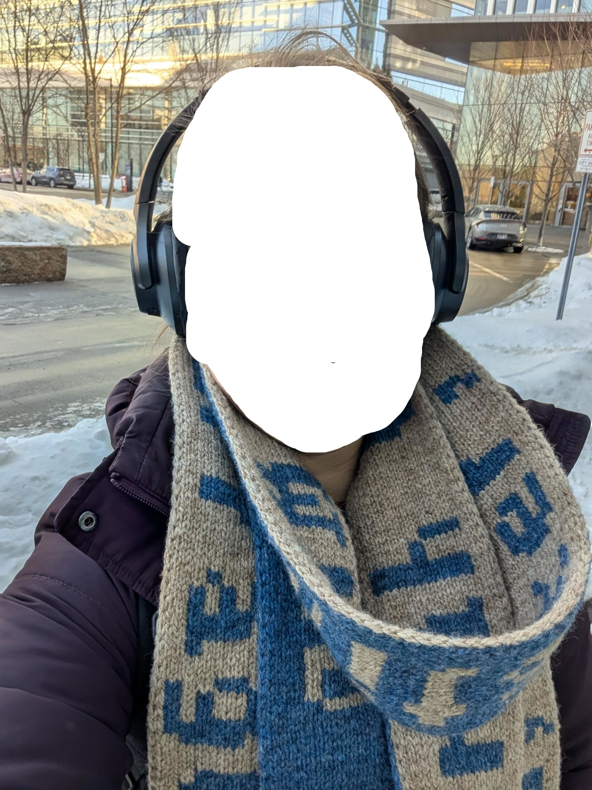

# Double knit pixelated scarf

This was meant to be a pretty easy introduction to double knitting, but with lots of length to get the muscle memory trained. 

The text is "If found, please return to "... and then a needlessly long full name and address. The final scarf was probably close to 9 feet. 

Here's is an image of the completed scarve with the happy recipient's face redacted for privacy.

The pattern follows the file vector-scarf.svg which has gridline aligned to the text pixels. Each pixel was 2 stitches by 2 rows which allowed the knitting of the backside to just follow exactly what was knitted on the front side. And each front-side row was a column of pixels per the font. 

Because, and I didn't quite realize this originally, rows are shorter than stitches are wide, the font came out a bit... horizontally abbreviated, but it ultimately looked pretty good and had the length I wanted.

Yarn was from Briggs and Little. I should have grabbed a photo ofd the tag... It was roughly a worsted weight. 
