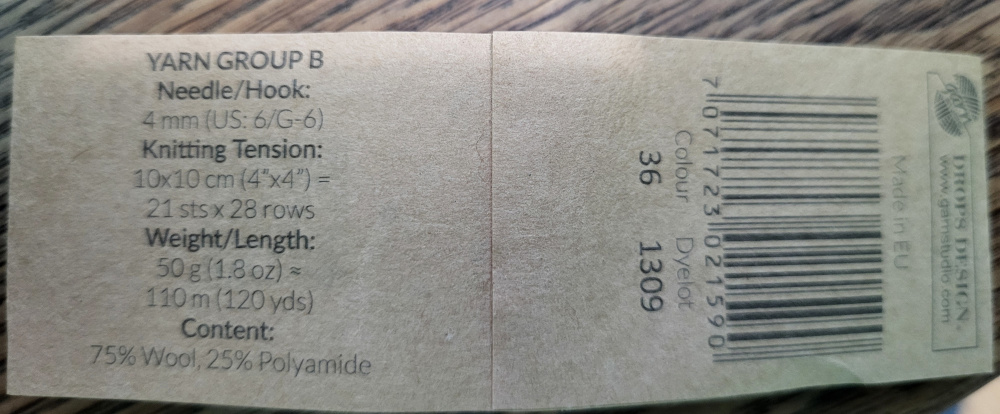

# Variegated DK sweater on smaller needles

Top down raglan with more ease than past patterns

## Gauge

After blocking:

* 100 rows: 28.5cm.
* 100 stitches: 39cm 

* st / row = 0.7307692
* row / st = 1.368421

3.5mm needles

## Pattern

Cast on 120st, long tail cast on. Work ~26 rows in 1/1 ribbing before folding over and picking up the cast-on edge to double-up the neckband.

Mark the raglan lines at 14s from CB for the back and and 20s forward from there for the front (14+20s from CB).
Now start working short-rows from the CB while doing increases (M!R, M1L) at the raglan increase points. Increases happen on the knit side while purl-side rows can just pass by the increase points. 

The back neck between the raglan lines should be flat, so the first short-row starts just _forward of_ the back raglan lines. On each row after, go 2st forward from the previous tight, doubled short-row turn stitch and turn on the second of those two stitches. Approaching the bottom of the CF neck, I changed this from 2st to 3st for the last two rows on each side to smooth the curve. The CF neck ended with 4 flat st, 2st on either side of CF.

Continue knitting around on the right side now, doing the increases (M1R, M1L) on the raglan lines every other row. This goes until the front panel reaches 100st wide between the stitch markers. The back panel should also reach 100st at the same time. The sleeves will be ~80st. (My counts were different by ~1-2, so not sure if I missed a stitch or something..)

From here, continue knitting around, but stop increasing the front panels; only increase the sleeve panels. Do this until...

