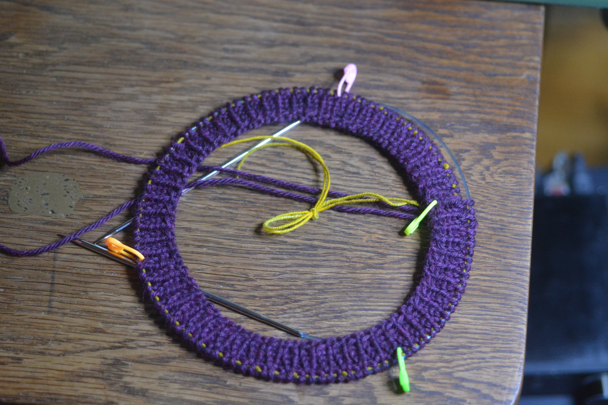
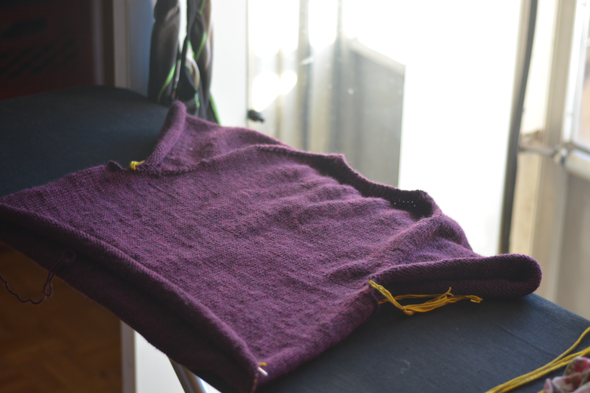

# Sweaters

## the plan so far

top down raglan in worsted wool (purple!). I have six hanks and pray it's enough. 

## swatches
swatched stockinette at 29 st = 5 3/4 in = 5.04st/in

swatched k1p1 rib 30st at 5" (stretched)
...assuming the neckband will relax under some tension

## the action so far

* For a 20" neckline, I cast on 120st joined in the round.
* Worked five rows in k1p1 rib, then put in a lifeline
* With the first stitch at center back, I marked the CF (opposite) and shoulder lines at 24st from CB.

* Raglan lines then are marked around the top sleeve at 18st and 34st from CB.
* start german short rows with the first set going to 10st from the CB, increasing 10st each row until reaching near the front
* after short rows, begin increases around the sleeve markers
    * raglan increases will be worked as a pair with two knits between M1R,K,K,M1L 
        * the marker between the K,K
    * after a row with increases, a row of only knits
* put in a lifeline after doing this for 22 rows
* stopped increasing the front and back panels at this point while still increasing the sleeves at the same rate
	* did this for 19 more rows, then decided I hadn't done enough short-row shaping and tossed in another pair of short-rows around the back and sleeves
	* another ten rows of the same increase pattern, then decided the body wasn't going to be broad enough after counting stitches and doing math. 

I am now aiming for the front and back panels to be equally wide at 98st = ~19.5". The sleeves aiming for 80st each for ~15.8" circumference

* At this point I did a haphazard series of increases and skipped increases to meet these goals that I probably should have set myself earlier. Once I get there I will try it on again and hopefully be ready to start separating the sleeves and body. 

## Splitting the sleeves from the body

Once the right length is reached, put the sleeve stitches on some waste yarn and set them aside for later. The division between sleeve and body is between the two knit stitches running along between the paired increases.

## Body

Once you've reached the underarm, separate the sleeves from the body and cast on 10st at the underarm on each side of the body. At theis point, the body will have XXXst in the round; just keep working it straight down until it's at the desired length ... TODO and add ribbing at the bottom. 

The image above shows the sweater's progress after three full hanks. 

## Sleeves

Pick up the sleeves following the instructions [here](https://www.youtube.com/watch?v=euTp37dlhlM). Add stitch markers between the regular and picked-up stitches. Work a few rows plain, then start paired decreases to cut down the added underarm stitches quickly. Paired decrease, then two rounds plain, and keep reducing like this until the added stitches are gone and the two markers are one. Now keep working the decreases one at a time on either side of the one marker, decrease, then two rows, decrease, then two rows, alternating sides. 

I ended the decreases with 10g of yarn left on the ball used for the sleeve, and 46s around the wrist. I then started a 1/1 rib tightly on smaller needles and continued that for about 3" before casting off loosely. 

